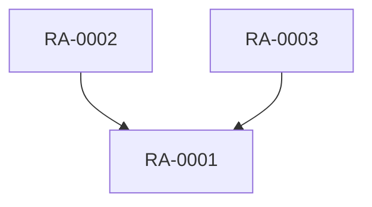

# Abstraction Levels & Render Targets ("unpack")

How a `Requirement Atom` projects to each artifact. Each render is a **deterministic projection**
from atom fields — no new content is invented; missing fields surface as explicit `[TBD]` markers.
This is the *synthesis* direction (decomposition → analysis → **synthesis**).

## Requirement levels

A common 0–4 requirement-leveling model (Value Chain → Functional):

```
0  Company Value Chain
1  Vision of needs            (Business / Support Divisions)
2  Scope for Project          (General High-Level WBS)
3  Business Requirements      (Feature list, High/Low WBS)
4  Functional Requirements    (Feature list in detail, Low WBS)   ◀── atoms live here natively
```

Atoms are extracted at **level 4** (the lowest, most concrete) and **roll UP** to 3 → 2 → 1 by
clustering, or project **sideways** to user stories, dependency maps, UX maps, and FORM-L code.

---

## Target 1 — L4 Functional Requirement + Acceptance Criteria

Mapping (one atom → one FR):
- **FR statement** = `When <when>, the <where> shall ensure <what> (within <how_well>).`
- **Acceptance criteria** = each `scenarios.nominal` → positive AC; each `scenarios.negative` → negative AC; `how_well` → measurable AC.
- **Fallback AC** from `else`; **invariant AC** from `limit` (Given/When/Then form).
- **Trace** footer: `Source: <transcript> [<timecode>] — <speaker>` + `Jira: <jira>`.

```
FR-<id>: When <when>, <where> shall <what> [within <how_well>].
  AC1 (nominal): ...
  AC2 (negative): ...
  AC3 (invariant): <limit> must always hold.
  Trace: RA-0001 ← 2024-01-15_sample-elicitation_cleaned.md [00:03:12] Product Owner | SHOP-101
```

## Target 2 — User Story + AC (Connextra)

- `As a <who>, I want <what> in <where>, so that <intent>.`
- AC from `scenarios` in Given/When/Then; `when` → the When clause; `how_well` → a measurable AC.
- Story points / priority NOT invented — left as `[TBD]`.

## Target 3 — L3 Business Requirement

- Restate `intent` + `what` in business language (drop formal operators), keep `who` as the
  beneficiary and `limit` as the business constraint. No scenarios, no signals.
- `BR: <who> needs <intent>, constrained by <limit>. Rationale: <verbatim source quote>.`

## Target 4 — L2 Project Scope (cluster)

- **Roll-up**: group atoms by `where` (or theme) → a scope/feature item with a Low/High WBS placeholder.
- Lists the member atom IDs; flags `conflicts_with` across the cluster.

## Target 5 — L1 Vision of needs (roll-up by WHO / theme)

- Group by `who` → a narrative "vision" paragraph per stakeholder/role summarizing their needs.
- Pure synthesis from `intent` fields; cite atom IDs.

## Target 6 — Dependency map

- Build a directed graph from `relations.depends_on` (and `refines`).
- Emit **Mermaid**:

- Conflicting pairs (`conflicts_with`) drawn as red dashed edges.

## Target 7 — UX mapping, direct & reverse

- **Direct** (req → UI): for each atom whose `where` names a screen/UI, list the UI element(s)
  and behavior flow it implies (`when` → trigger, `what` → behavior, `else` → error/empty state).
- **Reverse** (UI → req): given a screen, list which atoms govern each element — the coverage view
  that answers "why does this control exist?".
- Output mirrors the screen's "Layout Elements" + "Behavior Flows (1.1 ___ OR 1.2 ___)" structure.

## Target 8 — FORM-L code (for simulation)

- Concatenate the `forml:` blocks of the selected atoms into a `*.mo`-style snippet for the
  Modelica_Requirements toolchain (OpenModelica / OMEdit). Atoms with `forml: null` are listed as
  "not yet formalizable" with the reason.

---

## Round-trip contract (the falsifiable test)

For any atom A: `render(A → "stakeholder requirement")` must be judged **faithful** to A's
`source[].quote`. The validation workflow scores this 0–1. If round-trip fidelity is low, the
pack step is lossy and the idea fails for that atom — we report it rather than hide it.
